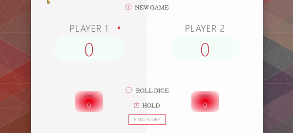

# Pig Game 

#### [Web Link](https://mclods.github.io/JavaScript-Pig-Game/)

> Pig is a simple dice game first described in print by John Scarne in 1945. As with many games of folk origin, Pig is played with many rule variations. Commercial variants of Pig include Pass the Pigs, Pig Dice, and Skunk. Pig is commonly used by mathematics teachers to teach probability concepts.

#### Pig Game Rules

* This game has __2__ players, playing in rounds.
* In each turn, a player rolls __2__ dice as many times as he wishes. Results of both gets added to his __ROUND__ score.
* But, if the player rolls a __1__ in either or both the dice, all his __ROUND__ score gets lost. After that, it's the next player's turn.
* The player can choose to _Hold_, which means that his __ROUND__ score gets added to his __GLOBAL__ score. After that, it's the next player's turn.
* A player can lose all his __GLOBAL__ score if both dice rolls to __6__ at the same time. After that, it's the next player's turn.
* The first player to reach 100 points or the chosen __FINAL__ score on __GLOBAL__ score wins the game.

